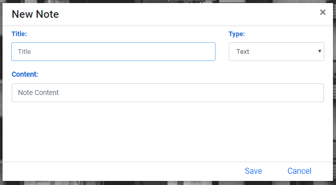
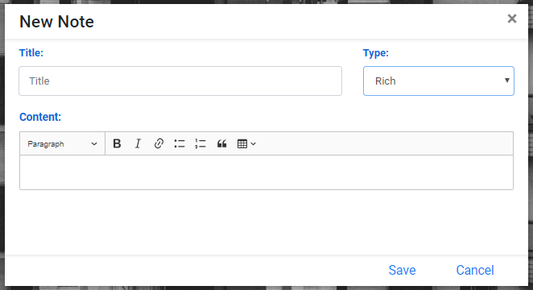
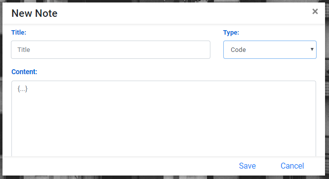
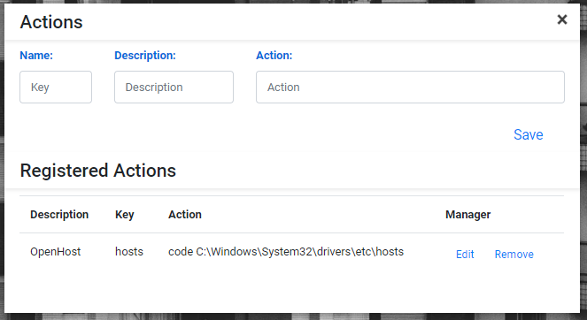
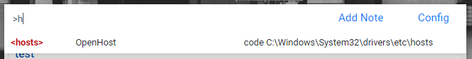

# easy-notes
A simple note manager with easy access.

## Download
You can download [here](https://github.com/mdsbarbieri/easy-notes/releases/tag/v1.0.1)!

> ```AuthorNote:```
>Until this moment, I didn't prepare versions to MacOs and Unix systems based, but this repository have MIT license and was built on [ElectronJS](https://electronjs.org/)/[NodeJS](https://nodejs.org/), then, you can download the source code, customize and build your own app version.

## The APP

### View Notes
The listener of toggle-view was binded in the command ```ctrl + shift + space```. The first view is collapsed *(based on Spotlight of MacOS)* and when you starting press letters keys the view will expand and start to show the filtereds notes, see it in follow examples.


*You can use \* bettwen two word to better specify your search and matching by two or more keywords*

### Add Notes
The app accept three types of input, Plain Text, Rich text and Code *(this option will format the code with Code Prettify)*





### Actions
In the Configuration tab, you can add actions to be executed in the System, the registered actions when triggers are executed on [Node ChildProcess]https://nodejs.org/api/child_process.html) and can whatever cmd comand that you want.



To trigger an action, you need enter in search input the char ```">"```, on do this, the list of actions that you had registered will be displayed in the view.



*You can register action with parameters, to do this, in Configuration panel, register action with the sintax ```"$" + "Number (started in 1)"``` and when you trigger, separe with white space the action key of parameters. Every additional word separated by white space will be considered one param.*

