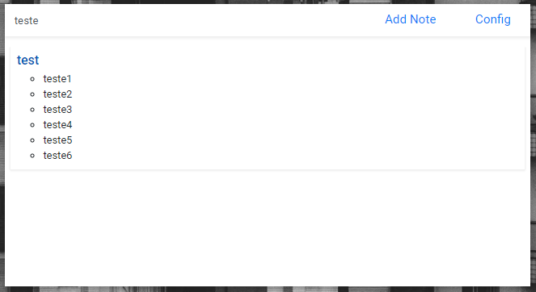

# easy-notes
A simple note manager with easy access.

> ```AuthorNote:```
>Until this moment, I can't prepare versions to MacOs or Unix systems based, but this repository have MIT license and was builted on [ElectronJS](https://electronjs.org/)/[NodeJS](https://nodejs.org/), then, you can download the source code, customize and build your own app version.


## The APP

### View Notes
The listener of toggle view was binded in the command ```ctrl + shift + space```, the first view is collapsed *(based on Spotlight of MacOS)* and when you starting press letters keys the view will expand and starting show the filtereds notes, see it in follow examples images.



*You can use \* inner two word to better specify you search and matching by two or more keywords*

### Add Notes
The app accepeted three types of input, Plain Text, Rich text and Code *(this option will format the code with CodePrettify)*


### Actions
In the Configuration tab, you can add actions to be executed in the System, the registereds action when triggered are executed on [Node ChildProcess]https://nodejs.org/api/child_process.html) and can whatever command language that you want.


To trigger an action, you need enter in search the char ```">"```, on do this, the list of actions that you had registered will be displayed in the view; 


*You can register action with params, to do this, in Configuration panel, register action with the sintax ```"$" + "Number (started in 1)"``` and when you trigger, separe with white space the action key of params. Every additional word separated by white space will be considered one param.*

